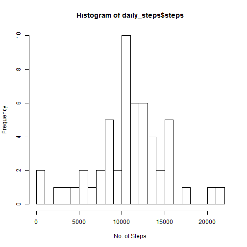
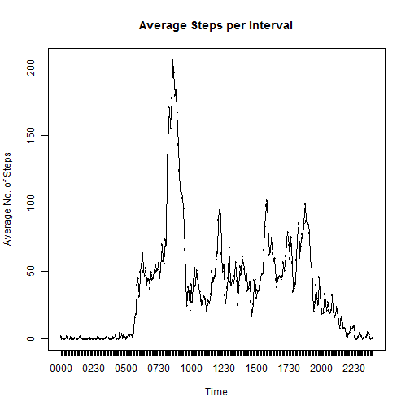
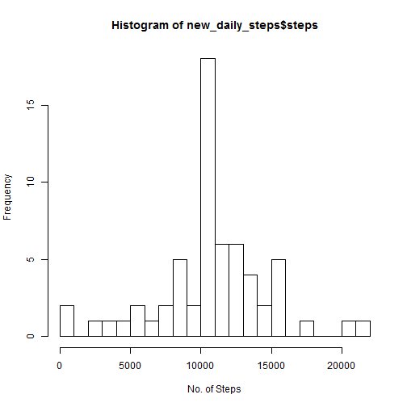
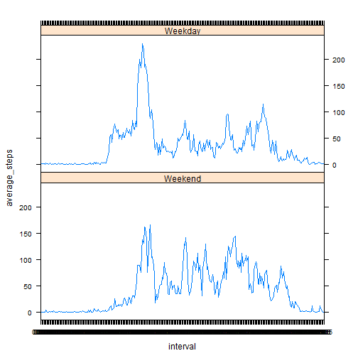

The code below explains how the data was processed in order for the analysis to take place.

The following R packages have been used in the preparing and analysising this data and the library calls are included in the first code chunk below;  
* dplyr  
* lattice  
* tidyr  
* stringr  
* chron  
* knitr  

## Loading and preprocessing the data


```r
library(dplyr)
library(lattice)
library(ggplot2)
library(lubridate)
library(tidyr)
library(stringr)
library(chron)
library(knitr)

zipLoc<-'./activity.zip'

unzip(zipLoc)

activity<-read.csv('./activity.csv', colClasses = c('numeric','Date','character'))

activity$date<-as.Date(activity$date)
activity$interval<-as.factor(str_pad(activity$interval,width=4,side='left', pad='0'))
```


## What is mean total number of steps taken per day?

```r
#Calculate and store the number of steps taken each day
daily_steps<-activity %>%
group_by(date) %>%
summarise(steps=sum(steps))

hist(daily_steps$steps, breaks=20, xlab='No. of Steps')
```

 

```r
#Calculate the mean number of steps. Remove NAs or Mean will return NA
mean<-mean(daily_steps$steps, na.rm=TRUE)
#Calculate the median number of steps. Remove NAs or Mean will return NA
median<-median(daily_steps$steps, na.rm=TRUE)
```

The mean number of steps is 1.0766189 &times; 10<sup>4</sup>

The median number of steps is 1.0765 &times; 10<sup>4</sup>

## What is the average daily activity pattern?

```r
#Calculate the average number of steps by interval. Remove NAs or Mean will return NA
avg_steps <- activity %>%
      group_by(interval) %>%
      summarise(average_steps=mean(steps, na.rm=TRUE))

#plot a time series graph of the 5 minute intervals
plot(x=avg_steps$interval,y=avg_steps$average_steps,type='b', xlab='Time'
     ,ylab='Average No. of Steps', main='Average Steps per Interval')
lines(avg_steps$average_steps)
```

 

```r
#Which interval has the highest average number of steps?
most_steps<-top_n(avg_steps,1,average_steps)
interval<-most_steps[,1]
```

The most steps are taken at 0835

## Imputing missing values

```r
#Calculate the number of records where steps aren't recorded
NAs<-sum(is.na(activity$steps))
```

The total number of records where there is no observation in the data set is 2304

To replace the NAs in this data set I first subset the data into a new object holding just the NA values.

Then using the avg_steps data set generated earlier I fill in the average steps for the missing interval.

Lastly i used row binding to join the previously NA records back into the dataset with the existing records

```r
#subset the rows without steps data
no_steps<-activity[!complete.cases(activity),]

#get average steps from earlier table to fill in blanks
NA_lookup<-left_join(no_steps,avg_steps, by = c('interval' = 'interval'))

#generate data to bind back into original
replaced_NAs<-NA_lookup[,c(4,2,3)]
names(replaced_NAs)<-names(activity)

#remove NAS from original
new_activity<-activity[complete.cases(activity),]
#nrow(new_activity)
#add in rows with calculated averages
new_activity<-rbind(new_activity,replaced_NAs)
#nrow(new_activity)

#Calculate daily steps from new data
new_daily_steps<-new_activity %>%
      group_by(date) %>%
      summarise(steps=sum(steps))

hist(new_daily_steps$steps, breaks=20, xlab='No. of Steps')
```

 

```r
new_mean<-mean(new_daily_steps$steps)
#Calculate the median number of steps. Remove NAs or Mean will return NA
new_median<-median(new_daily_steps$steps)
```

Having filled in the NAs with the average steps per minute for each interval the new mean and meadin values are;

Mean = 1.0766189 &times; 10<sup>4</sup>

Median = 1.0766189 &times; 10<sup>4</sup>

## Are there differences in activity patterns between weekdays and weekends?

```r
new_activity$weekend<-factor(is.weekend(new_activity$date), levels=c(TRUE,FALSE),
                             labels=c('Weekend','Weekday'))
str(new_activity)
```

```
## 'data.frame':	17568 obs. of  4 variables:
##  $ steps   : num  0 0 0 0 0 0 0 0 0 0 ...
##  $ date    : Date, format: "2012-10-02" "2012-10-02" ...
##  $ interval: Factor w/ 288 levels "0000","0005",..: 1 2 3 4 5 6 7 8 9 10 ...
##  $ weekend : Factor w/ 2 levels "Weekend","Weekday": 2 2 2 2 2 2 2 2 2 2 ...
```

```r
new_avg_steps <- new_activity %>%
group_by(weekend,interval) %>%
summarise(average_steps=mean(steps))

xyplot(average_steps ~ interval | weekend, new_avg_steps, layout=c(1,2), type='l')
```

 

